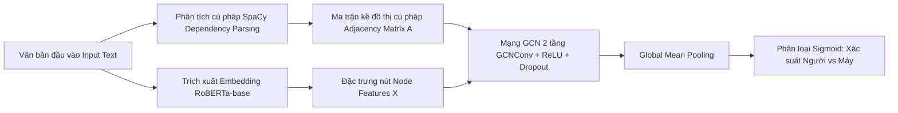

# PRDetect: Nhận diện văn bản do LLM tạo ra dựa trên Cây cú pháp kháng nhiễu (Perturbation-Robust LLM-generated Text Detection Based on Syntax Tree)

> **Tài liệu tham khảo chính:** Bài báo *"PRDetect: Perturbation-Robust LLM-generated Text Detection Based on Syntax Tree"*, công bố tại hội nghị quốc tế **Findings of the Association for Computational Linguistics: NAACL 2025** (trang 8305–8316).  
> **Nhóm tác giả:** Xiang Li, Zhiyi Yin, Hexiang Tan, Shaoling Jing, Du Su, Yi Cheng, Huawei Shen, Fei Sun (Viện Công nghệ Tính toán - Viện Hàn lâm Khoa học Trung Quốc CAS, Đại học UCAS).  
> **Kho lưu trữ gốc:** [GitHub - thulx18/PRDetect](https://github.com/thulx18/PRDetect)

---

## 1. Tổng quan & Đặt vấn đề (Background & Motivation)

### 1.1. Bối cảnh thực tế
Với sự phát triển bùng nổ của các mô hình ngôn ngữ lớn (LLMs) như GPT-3.5, ChatGPT, GPT-4,..., văn bản do AI sinh ra ngày càng xuất hiện dày đặc trên không gian mạng. Điều này đặt ra nhiều thách thức nghiêm trọng về an toàn thông tin và tính trung thực học thuật:
- Lan truyền tin giả, thông tin sai lệch có định hướng (Neural Fake News).
- Gian lận thi cử, đạo văn, tự động viết bài nghiên cứu khoa học khó phân biệt.
- Xuất hiện ảo giác thông tin (hallucinations) và thiên kiến (biases) tiềm ẩn trong văn bản.

Do đó, bài toán **Nhận diện văn bản do máy sinh (LLM-generated Text Detection)** trở thành một hướng nghiên cứu cấp thiết và sống còn trong xử lý ngôn ngữ tự nhiên (NLP) và an toàn AI (AI Safety).

### 1.2. Hạn chế cốt lõi của các phương pháp tiền nhiệm
Các phương pháp phát hiện văn bản AI hiện nay chủ yếu rơi vào 4 nhóm:
1. **Dựa trên đặc trưng thống kê (Feature-based):** GLTR, LLMDet (tính toán entropy, perplexity, rank từ tiếp theo).
2. **Mô hình học sâu tinh chỉnh (Fine-tuning Pretrained Models):** RoBERTa-detector (OpenAI), BERT, GPT-detector.
3. **Phương pháp Zero-shot:** DetectGPT, DetectGPT-SC, Fast-DetectGPT (dựa vào độ cong log-probability curvature).
4. **Kỹ thuật Thủy vân số (Watermarking):** Chèn watermark vào phân phối token khi sinh văn bản (đòi hỏi quyền can thiệp vào quá trình sinh của mô hình).

> [!WARNING]
> **Vấn đề thực tế: Tính dễ tổn thương trước nhiễu (Vulnerability to Perturbations)**  
> Các phương pháp trên thường chỉ hoạt động tốt trong điều kiện lý tưởng (văn bản hoàn toàn do AI sinh nguyên bản). Tuy nhiên, trong thực tế, người dùng rất ít khi dùng nguyên văn mà thường **chỉnh sửa, trau chuốt, thay thế từ đồng nghĩa** (human polishing/editing) trước khi xuất bản.  
> Thực nghiệm từ bài báo chỉ ra rằng: **Chỉ cần thay đổi nhẹ 5% – 10% từ ngữ trong câu bằng từ đồng nghĩa, độ chính xác của các mô hình hàng đầu như RoBERTa và CoCo lập tức sụt giảm thê thảm (từ gần 100% rớt xuống xấp xỉ 50% - bằng với đoán ngẫu nhiên).**

### 1.3. Ý tưởng then chốt của PRDetect
Nhóm nghiên cứu đã phát hiện ra quy luật bản chất:
- Các chỉ số thống kê (như perplexity, n-gram, chuỗi token) bị biến động mạnh khi có sự thay đổi từ ngữ.
- Đồ thị thực thể (Entity graph) dễ bị đứt gãy nếu thực thể bị thay đổi.
- **Ngược lại, Cây cú pháp phụ thuộc (Dependency Syntax Tree) gần như bất biến trước các nhiễu ở cấp độ từ (Perturbation-Invariant)**, đồng thời thể hiện **sự khác biệt cấu trúc rất rõ rệt giữa văn bản do con người viết và văn bản do LLM sinh ra**.

---

## 2. Phát hiện khoa học: Sự khác biệt Cây cú pháp giữa Người và Máy

Phân tích thống kê trên hai tập dữ liệu lớn (**HC3** và **GPT3.5-Mixed**) chỉ ra các sai khác đặc trưng về hình thái học và cú pháp:

| Đặc trưng cây cú pháp | Tập HC3 (Người viết) | Tập HC3 (LLM sinh) | Tập GPT3.5 (Người viết) | Tập GPT3.5 (LLM sinh) |
| :--- | :---: | :---: | :---: | :---: |
| **Độ sâu trung bình nút (Depth of Nodes)** | **2.80** | **3.26** | 3.13 | 3.15 |
| **Số lượng nút trung bình (Number of Nodes)** | **20.23** | **25.34** | 25.08 | 25.09 |
| **Chiều cao nút gốc (Height of Root)** | **4.79** | **6.38** | 5.61 | 6.18 |
| **Độ dài văn bản trung bình (tokens)** | 147.93 | 178.65 | 756.55 | 501.13 |

**Nhận xét quy luật:**
1. **Tính phức tạp cú pháp của LLM:** Câu do LLM sinh ra thường tuân thủ ngữ pháp rất chặt chẽ, có cấu trúc phân tầng sâu hơn (độ sâu nút cao hơn, chiều cao gốc lớn hơn) so với lối viết tự nhiên, ngắn gọn và linh hoạt của con người.
2. **Tính bất biến của cấu trúc:** Khi thay thế các từ ngữ (như tính từ, danh từ) bằng từ đồng nghĩa thích hợp, nhãn từ loại (POS) và quan hệ phụ thuộc (subject-verb, modifier, object,...) hầu như không đổi $\rightarrow$ Cấu trúc cây cú pháp giữ nguyên vẹn.

---

## 3. Kiến trúc & Quy trình hoạt động của PRDetect

Hệ thống PRDetect gồm 4 giai đoạn chính khép kín:



### 3.1. Phân tích cú pháp & Xây dựng đồ thị (Syntax Tree Construction)
- Sử dụng thư viện `spaCy` (mô hình `en_core_web_sm`) để tách câu, gán nhãn từ loại (POS tagging) và xác định quan hệ phụ thuộc ngữ pháp (hơn 50 loại quan hệ).
- Với mỗi từ $s_i$, xác định từ cha (head token) $s_j$.
- Thiết lập ma trận kề $A \in \{0, 1\}^{N \times N}$ biểu diễn đồ thị:
  $$A_{ij} = \begin{cases} 1 & \text{nếu } s_i\text{.head} = s_j \\ 0 & \text{ngược lại} \end{cases}$$
- Đồ thị được bổ sung liên kết tự khuyên (self-loops) $\hat{A} = A + I$ nhằm duy trì đặc trưng nội tại của từng nút trong quá trình tích chập.

### 3.2. Khởi tạo véc-tơ nút ngữ nghĩa (Node Encoding)
- Thay vì khởi tạo ngẫu nhiên, mô hình sử dụng **RoBERTa-base** (768 chiều) để sinh vector biểu diễn ngữ nghĩa cho từng token.
- Đối với văn bản dài vượt quá độ dài chuẩn, mô hình chia nhỏ thành các đoạn (chunks có kích thước tối đa 512 tokens) rồi ghép chuỗi đặc trưng lại với nhau.
- Việc kết hợp **Ngữ nghĩa từ RoBERTa** + **Cấu trúc từ Cây cú pháp** giúp mô hình hội tụ nhanh hơn và phân định chính xác hơn.

### 3.3. Mạng tích chập đồ thị (Graph Convolutional Network - GCN)
- Kiến trúc gồm 2 tầng tích chập đồ thị (`GCNConv`):
  $$H^{(l)} = \sigma\left(\hat{D}^{-\frac{1}{2}} \hat{A} \hat{D}^{-\frac{1}{2}} H^{(l-1)} W^{(l-1)}\right)$$
  - $\hat{A} = A + I$: Ma trận kề có self-loop.
  - $\hat{D}$: Ma trận bậc đường chéo (degree matrix).
  - $W^{(l)}$: Ma trận trọng số học được ở tầng $l$.
  - $\sigma$: Hàm kích hoạt phi tuyến ReLU kết hợp Dropout (tỷ lệ 0.5).
- Tầng đầu ra: Lớp tuyến tính `Linear(output_dim, 1)` gom đặc trưng bằng `Mean Pooling` qua toàn bộ các nút trong câu và đưa qua hàm `Sigmoid` để tính xác suất văn bản do con người viết ($y=1$) hay máy sinh ($y=0$).
- Hàm mục tiêu huấn luyện: Binary Cross-Entropy Loss (BCELoss).

### 3.4. Cơ chế mô phỏng nhiễu thực tế (Realistic Perturbation)
Để kiểm thử độ bền bỉ (robustness) trong điều kiện mô phỏng chỉnh sửa của con người:
- Lọc các từ loại mục tiêu (tính từ - adjectives) bằng SpaCy.
- Dùng từ điển `WordNet` (NLTK) để lấy danh sách từ đồng nghĩa phù hợp nhất và thay thế ở các tỷ lệ: **5%, 10%, 20%, 30%**.
- Kiểm tra độ dễ đọc bằng GPT-4o-mini: Điểm đọc hiểu (Readability) chỉ giảm nhẹ ~8.5%, đảm bảo câu văn vẫn tự nhiên, giữ nguyên ngữ nghĩa.
- Thử nghiệm mở rộng trên 4 kiểu nhiễu phổ biến: **Insert (Chèn)**, **Repeat (Lặp)**, **Replace (Thay thế)**, **Delete (Xóa)**.

---

## 4. Kết quả Thực nghiệm & Ưu điểm Nổi bật

### 4.1. Khả năng kháng nhiễu vượt trội (Perturbation Robustness)
Thực nghiệm so sánh độ chính xác (Accuracy) trên văn bản gốc và văn bản bị nhiễu thay thế từ đồng nghĩa:

| Mô hình | HC3 (0% nhiễu) | HC3 (5%) | HC3 (10%) | HC3 (30%) | GPT3.5 (0%) | GPT3.5 (5%) | GPT3.5 (10%) | GPT3.5 (30%) |
| :--- | :---: | :---: | :---: | :---: | :---: | :---: | :---: | :---: |
| **RoBERTa (Fine-tuned)** | 0.9380 | 0.5800 | 0.5570 | 0.5080 | 0.8927 | 0.5055 | 0.4995 | 0.4945 |
| **DetectGPT (Zero-shot)** | 0.8350 | 0.8010 | 0.7720 | 0.6580 | 0.6060 | 0.5860 | 0.5820 | 0.5500 |
| **CoCo (Entity Graph)** | **0.9981** | 0.5432 | 0.5421 | 0.5333 | **1.0000** | 0.6995 | 0.6893 | 0.6805 |
| **PRDetect (Ours)** | 0.9878 | **0.9878** | **0.9872** | **0.9864** | 0.9656 | **0.9630** | **0.9632** | **0.9638** |

> [!NOTE]
> **Điểm đột phá:** Khi tỉ lệ nhiễu tăng từ 0% đến 30%, độ chính xác của PRDetect **chỉ suy giảm tối đa 0.05%** (giữ vững phong độ >96% - 98%), trong khi RoBERTa và CoCo giảm tới gần 50%.

### 4.2. Hiệu năng & Tốc độ thực thi (Computational Efficiency)
Thử nghiệm trên phần cứng NVIDIA RTX 4090 (đơn vị: giây):

| Mô hình | Tiền xử lý Preprocessing (s) | Huấn luyện Training (s) | Thời gian Kiểm thử Test (s) |
| :--- | :---: | :---: | :---: |
| **RoBERTa** | - | - | 27.6s |
| **DetectGPT** | - | - | 1298.4s |
| **CoCo** | 2545.3s | 1655.0s | 28.3s |
| **PRDetect** | **1754.5s** | **629.7s** | **2.5s** |

- Tốc độ suy luận (Inference/Test) của PRDetect đạt **2.5s**, nhanh hơn **gấp 11 lần so với CoCo** và **gấp hơn 500 lần so với DetectGPT**.

### 4.3. Khả năng chuyển dịch tập dữ liệu (Cross-Dataset Transferability)
- Huấn luyện trên HC3 (văn bản ngắn hơn, đa lĩnh vực) $\rightarrow$ Kiểm thử trên GPT3.5-Mixed (báo chí, văn bản dài): Độ chính xác giữ vững **73.2% - 70.9%**.
- Huấn luyện trên GPT3.5-Mixed $\rightarrow$ Kiểm thử trên HC3: Đạt độ chính xác cao **87.7% - 87.0%**.

---

## 5. Cấu trúc Mã nguồn trong Dự án

Dự án này tổ chức các mã nguồn, tập dữ liệu và notebook thực nghiệm theo cấu trúc khoa học:

```plaintext
PRDetect-Research/
├── 2025.findings-naacl.464.pdf    # Toàn văn bài báo khoa học NAACL 2025
├── README.md                      # Tóm tắt hướng dẫn cài đặt & chạy nhanh
├── requirements.txt               # Các thư viện phụ thuộc của dự án
│
├── convert_datasets.py          # Script chuyển đổi dataset từ RAID/DetectRL sang format chuẩn
├── building_graph.py              # Script trích xuất Dependency Tree & sinh đồ thị (pickle)
├── building_graph.ipynb           # Notebook tương tác quá trình xây dựng đồ thị
├── gcn.py                         # File định nghĩa kiến trúc GCN (GCN2, GCN4) & huấn luyện
├── detect.py                      # CLI tool suy luận dự đoán cho một đoạn văn bản tùy ý
├── test.py                        # Script đánh giá mô hình trên các tập dữ liệu nhiễu
├── test_result.txt                # Nhật ký kết quả thực nghiệm chi tiết
├── drawtree.py                    # Script vẽ trực quan hóa cây cú pháp
│
├── datasets/                      # Thư mục chứa các bộ dữ liệu tải về (RAID, DetectRL,...)
│   ├── raid_dataset/              # 48 file JSON của benchmark RAID (GPT-2, LLaMA, Mistral, MPT,...)
│   └── detectrl_dataset/          # Dữ liệu DetectRL (main, attack, domain, length,...)
│
├── model/                         # Lưu các trọng số mô hình đã huấn luyện (.pth)
│   ├── hc3_gcn_model_*.pth        # Trọng số huấn luyện trên tập HC3 theo các random seed
│   └── gpt3.5_gcn_model_*.pth     # Trọng số huấn luyện trên tập GPT3.5-Mixed
│
├── original_text/                 # Chứa dữ liệu gốc (HC3, GPT3.5-Mixed JSON files)
├── perturbed_text/                # Dữ liệu đã áp dụng các kỹ thuật gây nhiễu
├── graph_data/                    # Dữ liệu đồ thị dạng tensor đã tiền xử lý (.pkl)
├── output/ & logs/                # Thư mục lưu trữ log và tensorboard
│
└── Các Jupyter Notebooks phân tích sâu:
    ├── depth_analyze.ipynb        # Phân tích độ sâu của cây cú pháp
    ├── distribution.ipynb         # Khảo sát phân phối độ dài văn bản
    ├── synonym.ipynb              # Tạo và kiểm thử tập nhiễu từ đồng nghĩa
    ├── other_perturb.ipynb        # Thực nghiệm các loại nhiễu Insert, Delete, Repeat
    ├── sample_similar_distribution.ipynb # Đánh giá dưới phân phối độ dài tương đồng
    └── gcn_transformer.ipynb      # Thử nghiệm biến thể kết hợp Transformer + GCN
```

---

## 6. Hướng dẫn Cài đặt & Sử dụng

### 6.1. Yêu cầu môi trường
- Python 3.8+
- Thư viện Deep Learning & Đồ thị: PyTorch, PyTorch Geometric (`torch_geometric`), Transformers, Scipy, NumPy.
- Thư viện NLP: `spacy` (kèm dữ liệu `en_core_web_sm`), `nltk` (kèm ngữ liệu `wordnet`).

Cài đặt các gói cần thiết:
```bash
pip install -r requirements.txt
pip install torch_geometric
python -m spacy download en_core_web_sm
python -c "import nltk; nltk.download('wordnet'); nltk.download('omw-1.4')"
```

### 6.2. Chuyển đổi dữ liệu kiểm thử mới (RAID / DetectRL sang PRDetect Format)

Sử dụng script `convert_datasets.py` đã được tích hợp để tự động trích xuất các cặp văn bản và định dạng lại thành file JSON Lines chuẩn trong `original_text/`:

```bash
# 1. Xem danh sách các file dữ liệu có sẵn trong datasets/
python convert_datasets.py --list

# 2. Kiểm tra các trường dữ liệu của một file cụ thể
python convert_datasets.py -i datasets/detectrl_dataset/main_dataset/detectrl_test_dataset_llm_type_ChatGPT.json --inspect

# 3. Chuyển đổi một tập test của RAID (ví dụ lấy 200 cặp = 400 mẫu để test nhanh)
python convert_datasets.py -i datasets/raid_dataset/raid_test_dataset_llm_type_gpt2_decoding_type_greedy_repetition_penalty_no.json -o raid_gpt2_test -n 200

# 4. Chuyển đổi tập DetectRL với trường văn bản bị tấn công/nhiễu (adversarial hoặc paraphrase)
python convert_datasets.py -i datasets/detectrl_dataset/main_dataset/detectrl_test_dataset_llm_type_ChatGPT.json -o detectrl_chatgpt_dipper -m paraphrase_dipper_llm -n 200
```
File sau khi chuyển đổi sẽ tự động nằm ở `original_text/<tên_output>.json`.

### 6.3. Các bước huấn luyện (Training Pipeline)

1. **Bước 1: Tiền xử lý & Xây dựng đồ thị cú pháp**  
   Chỉ định trực tiếp file cần build đồ thị cú pháp qua tham số `--file` (hoặc `-f`):
   ```bash
   # Build đồ thị cho 1 tập test cụ thể (VD: raid_gpt2_test)
   python building_graph.py --file raid_gpt2_test

   # Hoặc build cho nhiều file cùng lúc:
   python building_graph.py -f file1 file2 file3

   # Nếu không truyền tham số, mặc định sẽ build bộ 3 file: hc3_train, hc3_val, hc3_test
   python building_graph.py
   ```
   *File đồ thị sinh ra sẽ tự động được lưu vào `graph_data/<tên_file>.pkl`.*

2. **Bước 2: Huấn luyện mô hình GCN**  
   Huấn luyện mạng GCN trên đồ thị cú pháp và lưu checkpoint vào thư mục `model/`:
   ```bash
   python gcn.py
   ```

### 6.4. Kiểm thử & Đánh giá trên tập dữ liệu mới (Evaluation)
Chạy kiểm thử độ chính xác trên file đã sinh trong `graph_data/`:
```bash
python test.py --file raid_gpt2_test --dataset hc3 --seed 2024 -s
```

### 6.5. Dự đoán văn bản mới (Inference CLI)
Sử dụng script `detect.py` để phân loại một câu văn bản bất kỳ:
```bash
python detect.py --text "There are many factors that contribute to the intelligence gap between humans and other organisms." --dataset hc3 --seed 2024
```
**Kết quả trả về:**
- `probability`: Xác suất văn bản là do con người viết (từ 0.0 đến 1.0).
- `prediction`: Nhãn dự đoán (`1`: Human, `0`: Machine/LLM).

---

## 7. Đánh giá, Giới hạn & Tiềm năng Phát triển

### 7.1. Điểm mạnh cốt lõi
- **Kháng nhiễu cấp độ từ cực tốt:** Khắc phục được nhược điểm chí mạng của các mô hình LLM-detector truyền thống khi người dùng sửa đổi văn bản để né tránh kiểm duyệt.
- **Tốc độ suy luận vượt trội:** GCN trên ma trận kề thưa có kích thước nhỏ, suy luận nhanh gấp hàng trăm lần so với các phương pháp Zero-shot dựa vào LLM (như DetectGPT).
- **Tính khả giải thích (Interpretability):** Cho phép quan sát trực tiếp các liên kết cú pháp, chiều cao và phân bố cây ngữ pháp để giải thích lý do phân loại.

### 7.2. Các giới hạn còn tồn tại (Limitations)
- **Độ nhạy với văn bản ngắn (Short text):** Khi văn bản có độ dài dưới 100 tokens, cấu trúc cây cú pháp bị thu hẹp $\rightarrow$ độ chính xác giảm xuống khoảng 58% - 68%.
- **Nhiễu ở cấp độ câu (Sentence-level perturbations):** Nếu văn bản bị viết lại hoàn toàn (rewriting) hoặc dịch vòng (back-translation), cấu trúc câu bị thay đổi lớn, có thể ảnh hưởng đến hiệu quả của cây cú pháp.
- **Thời gian tiền xử lý SpaCy:** Việc xây dựng ma trận kề bằng công cụ phân tích cú pháp cần thời gian tính toán nhất định ở giai đoạn tiền xử lý.

### 7.3. Hướng phát triển trong tương lai
- Kết hợp đa phương thức: Kết hợp đặc trưng cây cú pháp với đặc trưng ngữ nghĩa sâu hoặc cơ chế Attention (Graph Transformer).
- Mở rộng hỗ trợ đa ngôn ngữ (Multilingual NLP) với các bộ parser cú pháp tiếng Việt, tiếng Trung, tiếng Pháp,...
- Tối ưu hóa mô hình cho các bài toán phân loại văn bản ngắn và phát hiện trộn lẫn (mixed human-AI text).

---

## 8. Trích dẫn (Citation)

```bibtex
@inproceedings{li2025prdetect,
  title={PRDetect: Perturbation-Robust LLM-generated Text Detection Based on Syntax Tree},
  author={Li, Xiang and Yin, Zhiyi and Tan, Hexiang and Jing, Shaoling and Du, Su and Cheng, Yi and Shen, Huawei and Sun, Fei},
  booktitle={Findings of the Association for Computational Linguistics: NAACL 2025},
  pages={8305--8316},
  year={2025}
}
```
